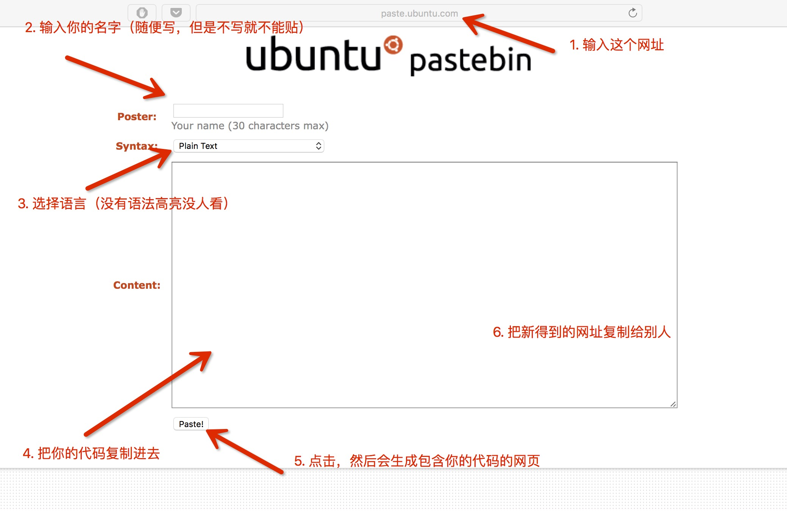

# 就当是课前预习

TODO：来点表情包。

## 如何使用codeblocks

Ctrl+Shift+N新建文件，Ctrl+S保存，保存的文件后缀名应为```.c```，F9编译并运行当前文件。

请参考群文件《codeblocks简单操作.pdf》 by 凯妹。

建议在设置的编译选项里加入```-Wall -Werror```以显示所有的编译器警告，可以避免一部分变量未初始化，if中使用=等常见错误。

## 代码风格

众所周知，良好的代码风格不仅可以使代码赏心悦目，还可以让代码更易读，减少bug数量~~的同时也可以减少学长帮忙看代码时的怒气值~~，故养成良好的代码风格甚至养成和同行人相同的代码风格是学习编程的重要一环。在养成自己的代码风格之前，我们可以考虑使用一些格式化工具帮助我们将代码整理成目前比较流行的代码风格。

### [Artistic Style](http://astyle.sourceforge.net/astyle.html)

标题链接就是这个工具的文档。支持多种目前比较流行的代码风格：gnu/linux/ansi/google等。**Codeblocks内置了该工具**，只需要在右键菜单选择格式化即可。详情参考群文件《codeblocks简单操作.pdf》 by 凯妹。

### [CppCheck](http://cppcheck.sourceforge.net/)

群友推荐的工具，我没用过，看文档感觉功能很强，而且自称**Codeblocks内置了该工具**。有codeblocks的同学在这补一个教程蟹蟹。

### [CppLint](https://github.com/google/styleguide/tree/gh-pages/cpplint)

夹带私货，这是我目前拄的拐杖的开源版本，不仅检查缩进，还会检查各种变量命名和使用，参数传递，类型转换，const之类的细节（虽然不知道开源了多少）。只支持Google代码风格~~简单来说就是两空格的异端~~。

### 大佬们补充一下

## 如何查字典

把你们手里的语法书扔掉，来尝试一下**宇宙最强的[CppReference](https://en.cppreference.com/w/)**。 这个网站收录了非常全面的C语言和C++标准文档，右上角的搜索键可以解决你对一切关键字和一切标准库的疑问（记得选C那边的结果）。悄悄地说其实这个网站支持中文，在页面最底下找找。

## 如何使用OJ

TODO: 群文件好像有？我回头找找。

## OJ常见错误类型

以下错误类型按照发生的时间先后顺序排序。**请勿反向debug**（指将后发生的错误修改成先发生的错误）。

### Compile Error

编译错误。将编译错误信息（codeblocks底部，或者OJ返回的信息）复制到搜索引擎中寻找答案。实在找不到且无法理解编译错误的内容的话，请[向学长提问](#如何提问)。

### Time Limit Exceeded / Memory Limit Exceeded / Runtime Error

1. Time Limit Exceeded：程序运行时间超过限制，请改进算法。

1. Memory Limit Exceeded：程序运行时使用的内存超过限制，请改进算法。

1. Runtime Error: 运行时错误（包括本地运行时程序崩溃，显示```Process terminated with status 某个反正不是0的数字```的现象），通常有以下几种原因：

    - 访问无效内存：数组越界，使用未初始化或已经释放的指针，将变量的值当做指针传递给函数参数（特别是scanf）等。

    - 递归层数过多，耗尽栈空间；

    - 整数除以0或对0取余数。

    部分OJ会直接提供Runtime Error的具体错误代码，此时通过搜索引擎可以直接找到对应的原因。[如何Debug？](#如何Debug)

### Wrong Answer （包括Output Limit Exceed）

1. Wrong Answer：程序在某一组数据上和标准答案不一致。[如何Debug？](#如何Debug)

1. Output Limit Exceed：输出长度超限，通常远超过标准答案的长度。由于标准答案长度显然不超限，该错误类型也属于Wrong Answer的一种。部分OJ不提供该错误类型，直接提供Wrong Answer。常见原因为程序无法正常停止。

### Presentation Error

格式错误。通常可以理解为，程序的输出和标准输出不一致，但去掉所有缩进（空格，回车，tab等）之后和标准答案一致。此时请重新读题，仔细检查题目要求的输出格式。

## 如何Debug

此处只讨论RuntimeError和WrongAnswer两种情况。

### 如何找到bug

如果要证明一个程序错了，那么只要找出一个反例即可。通常来讲，OJ会使用这个思路来测试我们的程序（通过带入大量数据进行尝试寻找反例，找不到即认为程序功能正确），我们也可以使用同样的思路来调试。常用的寻找反例方式有如下几种：

#### 尝试样例数据

这……恐怕大家提交之前都会试一下吧……

#### 尝试极限数据

通常情况下，题目本身都会规定输入数据的可能的上下界，而这些上下界通常不是随意指定的（比如上界通常都会使运行时某些数值恰好不超过或者恰好超过某种数据类型的极限，或者恰好能使某种算法不超过运行时间限制或者超过运行时间限制），此时我们可以直接使用上界和下界分别构造一组测试数据，手算（由于上下界通常是比较整的数字，多数时候可以手算得到答案）期望输出，与程序的实际输出对比。如果数据规模太大导致难以手动输入到程序执行窗口中，[freopen][字典]这个函数可以非常方便的帮助测试。

#### 尝试特殊类型的数据

这种操作更多的要看经验，通过分析题目的性质找出输入数据可能存在的特殊情况来测试。举个例子：假如题目给定三条边长度a、b、c，要求判断这三条边能否构成一个三角形，那么输入就可能有a+b<c, b+c<a, c+a<b, 以及能够成三角形的一些情况。此时若程序无法通过该题目，则可以考虑是否忽略了a+b=c这种特殊的不能构成三角形的情况。然后构造满足这种情况的输入进行检验。

#### 对拍随机数据

更多的情况下，输入数据的特殊情况难以直接通过分析猜到，此时可以考虑随机（[rand][字典]）产生大量的数据进行验算，以求随机得到能导致程序出错的情况。[freopen][字典]。此时由于数据规模过大，通常无法手动验算，此时可以对该题目另写一个正确性更强（但可能速度更慢或者支持的数据范围更小）的程序，使两个程序对同样的输入数据进行计算，期望两者应该获得相同的输出，通常称为“对拍”。你需要：

1. 一个随机生成输入数据的程序 1.c；

1. 一个你对该问题设计的程序 2.c；

1. 一个你认为这要是能错就把电脑屏幕吃进去的程序 3.c；

1. （可选）一个调用1产生输入数据，调用2和3产生输出并对比的脚本 4.bat，内容如下（windows系统下）：

```
gcc 1.c -o 1 -O2
gcc 2.c -o 2 -O2
gcc 3.c -o 3 -O2
for /l %%i in (1, 1, 100) do (1 > 1.in && 2 < 1.in > 2.out && 3 < 1.in > 3.out && fc 2.out 3.out || pause)
```

双击运行4.bat，它会在找到不同或者运行满100次之后停下来。

### 如何解决bug

假设我们已经[准备了一组能使程序运行结果不符合预期的输入](#如何找到bug)。既然我们的程序在这组输入数据上不符合预期，那我们想必对该程序的每一部分操作都有一个预期，包括程序的执行流程，各个变量的值的变化等。我们可以用如下方式来分析程序的实际执行流程：

#### 使用[printf][字典]

在每次逻辑跳转([if, switch, 函数等][字典])之前和之后，打印一个标记，用来跟踪程序的执行流程，例如：

```
printf("==> IF 1: %d, %d, %d\n", a, b, c);
if (a + b < c) {
  printf("====> THEN 1\n");
  ...
} else {
  printf("====> ELSE 1\n");
  ...
}
```

在每行语句执行完之后，加一行printf，将这行语句涉及到的所有变量的值打出来，以跟踪变量的变化，例如：

```
a = b + c;
printf("--> a = b + c: a: %d, b: %d, c: %d\n", a, b, c);
```

然后输入之前准备好的数据，仔细检查每一次逻辑跳转和变量变化是否符合预期。

#### 使用调试工具

TODO：大佬来个gdb教学

## 如何提问

详尽提供信息是高效沟通的前提。在向学长提问时，你需要准备以下内容：

1. **题面**：最好是题目链接，在大家达成共识的情况下可以使用题号（例：这周的作业C题），实在找不到题目再口述题目大意（特别是某些容易读错题的同学）。

1. **代码**：先[对代码进行格式化](#代码风格)。**不要**把代码直接复制粘贴到聊天窗口，**不要**拍屏幕，**不要**对超过20行的代码截图，尽量不要对代码截图。[正确的方式](http://paste.ubuntu.com)：（6步）


1. **运行结果**：分成以下几种情况讨论

    1. 程序无法编译：请先将codeblocks底部的编译错误信息复制到搜索引擎中寻找答案。如果没有找到答案，对**完整的编译错误信息**截图。

    1. 程序能够编译，无法完整执行：提供你正在使用的能导致运行出错的**输入数据**，以及**运行窗口**截图，包括任何在运行期间弹出的窗口，和codeblocks底部出现的**任何错误信息**。

    1. 程序能够执行，结果不符合预期：运行结果应该包含三个部分：**输入数据**：单独提供，**期望输出**：单独提供，**实际输出**：通过对运行窗口截图来提供。如果是题目自身提供的样例，只需要指明输入和期望输出是哪一组即可。

    1. 程序能够执行，结果符合预期，OJ返回WrongAnswer：请**先**试着[自己找debug](#如何找到bug)。如果能找到，参考上一条；否则不用提供运行结果。

[字典]: #如何查字典
